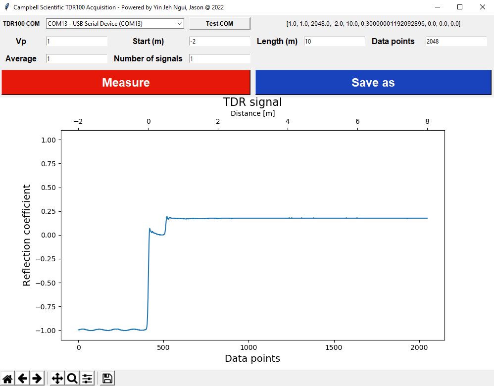
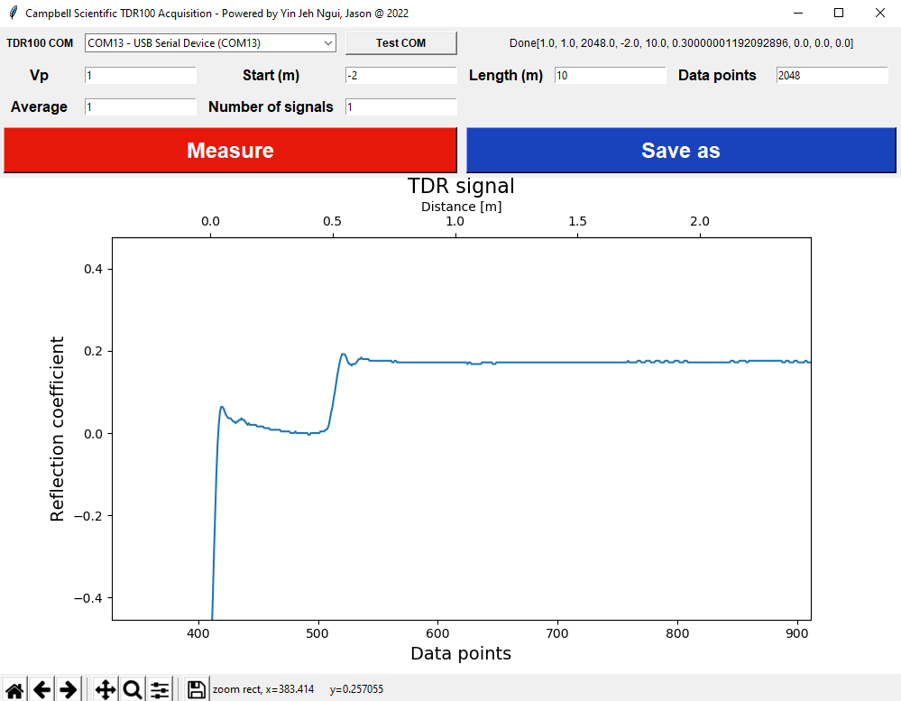
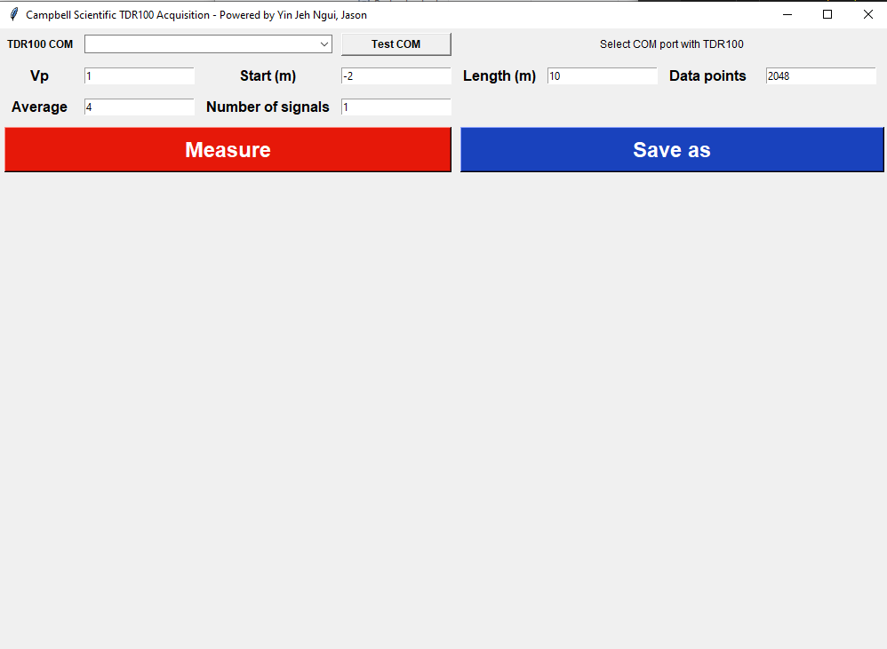

# Builds
v1.0.1
- Added twin axis with data points and distance.
- Added header information to the output data file. 
- Sample screenshots

v1.0.0
- initial commit
- For some faulty TDR100, several warmup acquisitions are needed to obtain correct TDR signal/waveform.
- Error message are shown in top right to demonstrate whether the acquired signals are correct
- Built in python with pyinstaller 
- Save file with data only, no acquisition parameter included
- Acquired signals/waveforms are plotted with matplotlib with toolbar to save/zoom/home the signals
- Sample screenshot

